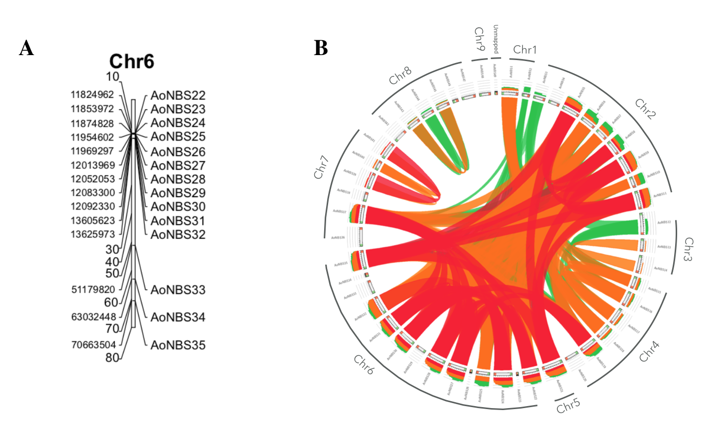

Here, we performed a genome-wide analysis and comprehensive characterization of 49 NBS-LRR loci in the asparagus reference 
genome. Take-away message:  
  1. NBS genes are unevenly distributed through the genome and nearly 50% of the genes are present in clusters. Chromosome 6 
  is significantly NBS-enriched and one single cluster hosts 10% of the genes.
  2. Recent duplications are likely to have dominated the NBS expansion with both tandem genes and duplication events across 
  multiple chromosomes. Almost all the segmental duplications that we can detect have evolved from these recent events.
  3. Expression data revealed that most of the duplicated members within a group exhibited the same expression pattern, 
  suggesting that the functional conservation of the duplicated family members is a major feature of the evolution of these 
  genes.

 
  
  
  
  Figure1. Legend

If you use any of those resources for your research, please cite: 

Die JV, Castro P, Millan T, Gil J. (2018) [Segmental and Tandem Duplications Driving the Recent NBS-LRR Gene Expansion in the Asparagus Genome](https://www.mdpi.com/2073-4425/9/12/568). Genes, 9(12), 568; doi: 10.3390/genes9120568
