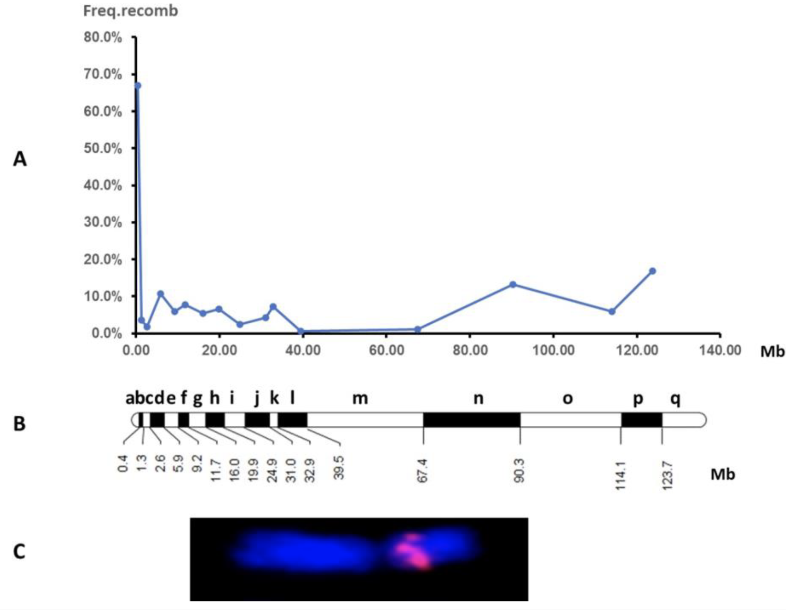

Here, we performed a quantitative trait loci (QTL) analysis to understand the genetic control of quantitative agronomic traits in garden asparagus. Take-away message:  
1. Two major QTLs for number of stalk and earliness were mapped in a genomic region that spans 3.25 Mb and includes the sex-determination locus on chromosome 1. 
2. Some QTLs for branching height and earliness were detected in a bin that spans 4.96 Mb on chromosome 5.   
3. Functional annotation of genes within the two genomic regions revealed candidate genes with potential roles in SA and light signaling and photomorphogenesis pathways that may be involved in branching and/or tillering. 

 

   
  
  
  **Figure1. A.** Distribution of recombination frequency between bins along chromosome 1 of *A. officinalis*. **B.** Map bins. **C.** Fluorescence in situ hybridization (FISH) with rDNA 5s probe on chromosome 1.  

 
  
If you use any of those resources for your research, please cite: 

Garcia V, Castro P, Die JV, Millan T, Gil J, Moreno R. (2023) [QTL Analysis of Morpho-Agronomic Traits in Garden Asparagus (*Asparagus officinalis* L.)]([https://www.mdpi.com/2073-4425/9/12/568](https://www.mdpi.com/2311-7524/9/1/41)). Horticulturae 2023, 9(1), 41; doi: 10.3390/horticulturae9010041
